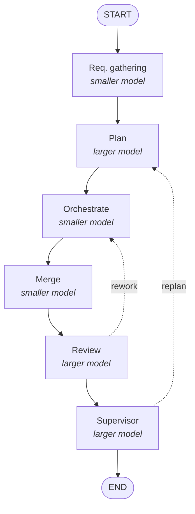

# Agent Pipeline — Hand-Drawn Flowchart, Explained

Companion to `node_modules/maestro-flow/Agents Notes.md` (the 6-agent spec).
This file transcribes and explains the hand-drawn flowchart of the same pipeline.

---

## 1. What the drawing contains

Six boxes between a `START` oval and an `END` oval, each annotated with (a) the
size of model that should run it and (b) what it produces.

| # | Box | Model | Annotation on the drawing |
|---|-----|-------|---------------------------|
| 1 | **Req. gathering** | smaller | asks user's specifications *(Gen A)*; writes in md file |
| 2 | **Plan** | larger | writes in md file |
| 3 | **Orchestrate** | smaller | divides tasks if possible for parallel exec. |
| 4 | **Merge** | smaller | merge worktrees (if any) |
| 5 | **Review** | larger | writes in the md file |
| 6 | **Supervisor** | larger | *(no further annotation)* |

> The parenthetical after "asks user's specifications" is hard to read — it scans
> as `(Gen A)` or `(Gem A)`. Given Agent 1 in the notes is the **Gemini CLI**
> requirements agent, it most likely abbreviates *Gemini Agent*. Treat as
> uncertain until confirmed.

---

## 2. Flow of control

**Forward path (single unbroken chain):**

```
START → Req. gathering → Plan → Orchestrate → Merge → Review → Supervisor → END
```

Note the geometry: `Orchestrate` exits from its **right** edge, drops down the
right side of the page into `Merge`, and the bottom row then runs **right to
left** — `Merge → Review → Supervisor → END`. The bottom row reads backwards
compared to the top row; that is a layout artifact, not a reversal of the flow.

**Two feedback edges (the long lines running back up the page):**

| Edge | Meaning |
|------|---------|
| `Review → Orchestrate` | Review rejected the work. Go back to execution — not to planning. The plan was fine; the implementation wasn't. |
| `Supervisor → Plan` | Supervisor rejected the finished result against the original requirements. Go back and re-plan. The implementation may have been fine; the plan was wrong or incomplete. |

Each of those two boxes therefore has **two incoming arrowheads** on its left
edge — one from the normal forward path, one from its feedback loop. That
stacked pair of arrowheads is the visual signature of a re-entry point.

`Req. gathering` has no incoming feedback edge. Once the user's requirements
are captured, the pipeline never re-asks for them; it only re-plans against them.

### Same graph as Mermaid



---

## 3. The organising idea: two tiers of model

The drawing's most deliberate decision is the **alternation between smaller and
larger models**, and it is not arbitrary. Sort the six boxes by which tier they
sit in and a clean rule appears:

**Smaller model — mechanical / dispatch work**
- `Req. gathering` — transcribing what the user says into a file
- `Orchestrate` — reading `plan.json` / `TASK-*.json` and dispatching waves
- `Merge` — merging git worktrees

**Larger model — judgment work**
- `Plan` — deciding *what* to build and how to decompose it
- `Review` — deciding whether the implementation is acceptable
- `Supervisor` — deciding whether the whole thing satisfies the requirements

Every box that makes a **quality or correctness judgment** gets the larger model.
Every box that **moves data around** gets the smaller one. This is also exactly
where the cost sits: the three cheap boxes are the ones invoked most often
(orchestration and merging run once per wave), and the three expensive boxes are
the gates.

Note that both feedback edges originate from a **larger-model** box. Only the
expensive, judgment-capable agents are allowed to send the pipeline backwards.
The cheap agents move it forwards only.

---

## 4. How the drawing maps onto `Agents Notes.md`

The flowchart is a one-to-one rendering of the six agents in the notes:

| Drawing box | Notes agent | Stated CLI in the notes |
|-------------|-------------|-------------------------|
| Req. gathering | Agent 1 — requirements_gathering | Gemini CLI |
| Plan | Agent 2 — planner | Codex or Claude Code CLI |
| Orchestrate | Agent 3 — orchestrator | Gemini CLI |
| Merge | Agent 4 — merger | Gemini CLI |
| Review | Agent 5 — reviewer | heading says Gemini; body says "claude code or codex cli based" |
| Supervisor | Agent 6 — supervisor | heading says Gemini; body says "claude code or codex cli based" |

Both feedback edges are stated in the notes prose and match the drawing exactly:

- Agent 5: *"If needed, adds new implementation comments that are given back to
  the same coding subagent (same session id), its worktree's work is
  reverted/deleted, and the process cycles."* → the `Review → Orchestrate` edge.
- Agent 6: *"If not satisfactory, it provides comments to planner agent and the
  process cycles."* → the `Supervisor → Plan` edge.

### The drawing resolves a contradiction in the notes

Agents 5 and 6 have **Gemini CLI-based** in their headings but **"claude code or
codex cli based"** in their bodies. The drawing marks both boxes *larger model*,
siding with the bodies. The headings on Agent 5 and Agent 6 look like stale
copy-paste from Agents 3 and 4 and should be corrected in the notes.

---

## 5. What the drawing leaves out

The flowchart is the control-flow skeleton. Four things in the notes have no
representation in it:

1. **The wave loop inside `Orchestrate`.** The notes say the orchestrator "runs
   the waves… when one wave is completed it dispatches the next until all tasks
   have been completed," and that the merger runs *after each wave*. So
   `Orchestrate → Merge → Review` is itself an inner loop executed once per wave;
   the drawing shows it as a single pass. `Supervisor` is described as running
   only "when all waves are completed" — it sits outside that inner loop.
2. **The coding subagents.** Individual coding agents, each in its own git
   worktree, live *inside* the `Orchestrate` box. They are why `Merge` exists.
3. **`learnings.md`.** Four of the six agents are told to append new findings to
   a shared learnings file. That is a write-side channel touching most boxes and
   is invisible in the drawing.
4. **`user_choices.md`.** The notes' closing section defines a strict record of
   explicit user decisions only — no assumptions, no inferences. That artifact
   belongs to the `Req. gathering` box, alongside the `context.md` it writes.

### Artifacts flowing along the forward path

Reconstructed from the notes, the edges carry:

```
Req. gathering  --context.md, user_choices.md-->  Plan
Plan            --plan.json, TASK-*.json------->  Orchestrate
Orchestrate     --git worktrees per subagent---->  Merge
Merge           --merged branch----------------->  Review
Review          --review notes (md)------------->  Supervisor
```

And along the feedback edges: `Review` sends implementation comments back to the
*same* coding subagent session; `Supervisor` sends requirement-level comments
back to the planner.

---

## 6. Open questions the drawing raises

- **No termination guard on either loop.** Nothing in the drawing or the notes
  caps how many times `Review → Orchestrate` or `Supervisor → Plan` may fire. A
  max-iteration count or an escalation-to-user path is needed before this runs
  unattended.
- **`Supervisor → Plan`, not `→ Req. gathering`.** If the supervisor finds the
  requirements themselves were misunderstood, re-planning against the same
  `context.md` will reproduce the misunderstanding. Whether that case should
  escalate to the user is unspecified.
- **"Smaller" and "larger" are unbound.** The drawing states a tier, not a model.
  Which concrete models fill each tier still has to be decided and written down.
